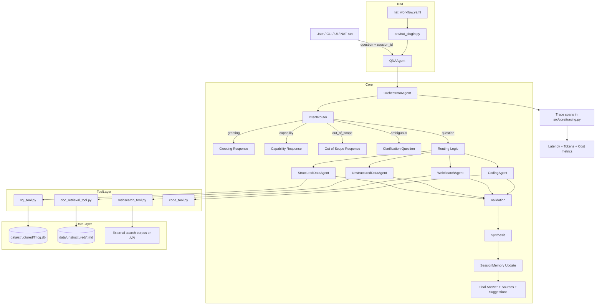
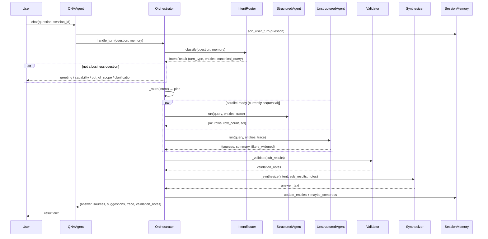

# Architecture

## System overview

FMCGQABOT is a multi-agent Q&A system built on a hand-rolled orchestration layer
over four specialised sub-agents, with NAT (NeMo Agent Toolkit) providing the
runtime, tracing, and component-declaration surface.

---

## High-level component diagram



---

## Request / response data flow



---

## ASCII overview diagram

```
                              ┌─────────────────────────┐
  User turn ──────────────▶  │   OrchestratorAgent       │
                              │  (src/core/orchestrator)  │
                              └────────────┬─────────────┘
                                           │
                       ┌───────────────────┼────────────────────┐
                       ▼                                        │
             ┌───────────────────┐                              │
             │   IntentRouter      │  (src/core/intent.py)      │
             │  - greeting/capability/out-of-scope/ambiguous     │
             │  - alias + typo correction (brand/region/KPI)     │
             │  - multilingual cue detection                     │
             │  - entity carry-over from SessionMemory            │
             └───────────────────┘                              │
                       │  turn_type == "question"                │
                       ▼                                        │
             ┌───────────────────┐                              │
             │      Router         │  keyword + entity based    │
             │  (orchestrator._route)                            │
             └─────────┬─────────┘                               │
        ┌───────────────┼───────────────┬───────────────┐        │
        ▼               ▼               ▼               ▼        │
 ┌─────────────┐ ┌───────────────┐ ┌────────────┐ ┌────────────┐ │
 │ Structured    │ │ Unstructured   │ │ WebSearch   │ │  Coding    │ │
 │ Data Agent    │ │ Data Agent     │ │ Agent       │ │  Agent     │ │
 │ NL→SQL +      │ │ TF-IDF +       │ │ (mock/live  │ │ sandboxed  │ │
 │ SQL guard     │ │ metadata filter│ │  provider)  │ │ Python exec│ │
 └──────┬────────┘ └───────┬───────┘ └──────┬──────┘ └─────┬──────┘ │
        │                  │                │              │        │
        ▼                  ▼                ▼              ▼        │
 fmcg.db (SQLite)   data/unstructured/*.md  curated corpus  numeric  │
                                                              context │
        └──────────────────┴────────────────┴──────────────┘        │
                                   │                                  │
                                   ▼                                  │
                    ┌───────────────────────────┐                    │
                    │  Validation                 │  empty results?  │
                    │  (orchestrator._validate)    │  failed query?   │
                    └──────────────┬────────────┘  narrowed filters? │
                                   ▼                                  │
                    ┌───────────────────────────┐                    │
                    │  Synthesis                  │  merge + cite +  │
                    │  (orchestrator._synthesize)  │  format + retry │
                    └──────────────┬────────────┘  hints             │
                                   ▼                                  │
                    ┌───────────────────────────┐                    │
                    │  SessionMemory update        │◀──────────────────┘
                    │  (entities + rolling summary)│
                    └──────────────┬────────────┘
                                   ▼
                              Final answer
                        (markdown, cited, with
                         follow-up suggestions)
```

Every step above is wrapped in a `Trace` span (`src/core/tracing.py`) capturing
duration, and — for LLM calls — token counts and estimated cost. The full span
list for a turn is returned alongside the answer (`result["trace"]`) and is what
the cost/latency analysis in `docs/cost-latency-tradeoffs.md` is built from.

## Turn lifecycle

1. **Intent gate** (before any retrieval, per the assessment's "intent validation
   before data retrieval" requirement): greetings, capability questions, and
   out-of-scope requests are resolved here and never reach a sub-agent. Ambiguous
   follow-ups with no resolvable entity and no session context trigger a
   clarification question instead of guessing.
2. **Entity normalization**: brand/region/KPI aliases and typos are resolved
   against small dictionaries (`BRAND_ALIASES`, `REGION_ALIASES`, `KPI_ALIASES`),
   with `difflib`-based fuzzy correction for misspellings. Unsupported regions and
   out-of-data-coverage years are flagged explicitly here so downstream retrieval
   doesn't silently produce a misleading answer.
3. **Routing**: a lightweight keyword+entity heuristic decides which of the four
   sub-agents are actually relevant — most non-trivial questions ("why did X
   happen") hit more than one, which is what exercises the "hybrid data retrieval"
   requirement.
4. **Sub-agent execution**: each sub-agent is tool-first — the structured agent
   never lets the LLM touch the database directly, it only ever gets to *propose*
   a query, which is then parsed and validated by `sql_tool.py` before execution,
   with one retry on failure or unexpected-empty-result.
5. **Validation**: checks each sub-agent's result for emptiness/failure/widened
   filters and turns them into explicit notes rather than silently dropping them.
6. **Synthesis**: assembles a single answer from whatever sub-agent output exists,
   in real mode asking the LLM to turn the structured sections into fluent prose
   *without inventing new numbers* (the prompt explicitly forbids it); in mock
   mode the sections are concatenated directly (still fully grounded, just less
   fluent — see cost-latency doc).
7. **Memory update**: the turn is added to `SessionMemory`; every 6th+ older turn
   is folded into a rolling summary so long sessions don't grow the context window
   unbounded.

## Data model

See `src/tools/sql_tool.py`'s `SCHEMA_DESCRIPTION` and
`src/data_gen/generate_data.py` for the full synthetic FMCG universe: 5 brands ×
10 SKUs × 4 regions × 4 channels × 12 months of sales/discount/inventory data,
plus 5 promotional campaigns, all cross-referenced by the 10 unstructured
documents (market reports, launch memos, promo playbooks, finance notes — including
one deliberately superseded finance note, to exercise recency-aware document
filtering).
